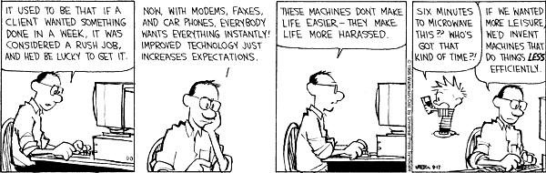

# Git Practice

## [ChatGPT Is About to Dump More Work on Everyone](https://www.theatlantic.com/technology/archive/2023/02/chatgpt-ai-detector-machine-learning-technology-bureaucracy/672927/)
&nbsp;This article's content reminds me of the blockchain craze around 2017 that I barely remember. It seemed like everyone wanted to incorporate blockchain into their product without even knowing what blockchain technology was. Whenever a new 'groundbreaking' technology is introduced, well before people understand it's capabilities or limitations, companies jump on it because they don't want to be left behind. I do not want to be working at a company where my product manager tells me i need to incorporate chatGPT without telling me how or why, but i see that in my future. 
 
&nbsp;The author discusses the concept of "hyperemployment", where new technologies have made it so that individuals are expected to be fully competent in fields that were once specialized. "Data dashboards and services make office workers part-time business analysts. On social media, many people are now de facto marketers and PR agents for their division and themselves." 
I'm reminded of a calvin and hobbes comic

I imagine Calvin's dad would not enjoy slack